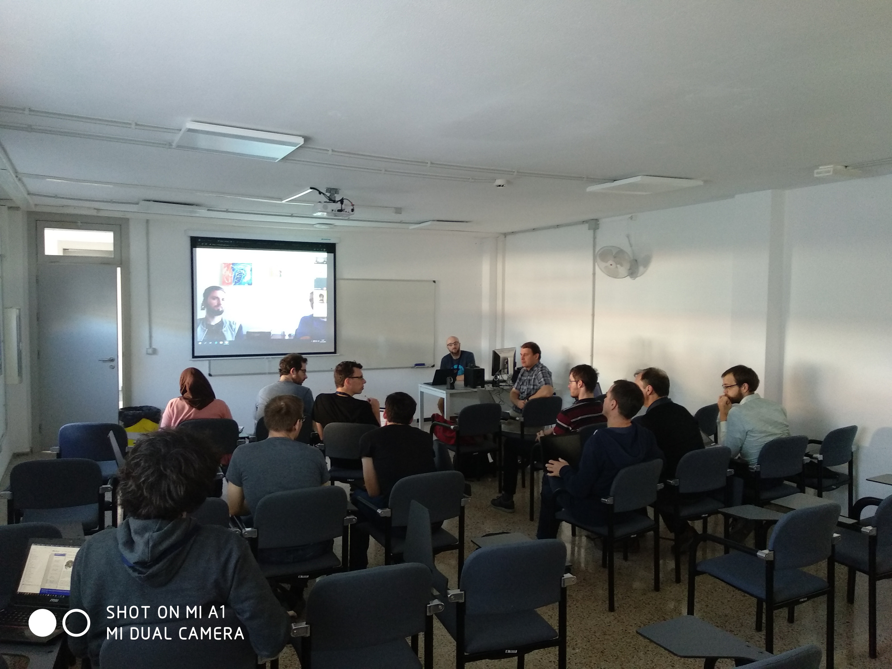

Back to [Breakout Sessions List](../README.md#breakout-sessions)

# Machine learning best practices

We will share with each other how machine learning is implemented by various groups, see if we can find common patterns and way of leveraging similar efforts.

Anybody who is interested in using machine learning for medical image computing is welcome.

## Meeting minutes

Meeting minutes are available [here](https://docs.google.com/document/d/1LeSxafO3YzgRHRDnjyA-aQSkcKlbk__QLiJLNQi615o/edit).

## Agenda

Lookup day and time on the [calendar](../README.md#program-calendar).

Hangout link is [https://meet.google.com/xkf-ymeb-rqs](https://meet.google.com/xkf-ymeb-rqs)

* Presenting current approaches for
  * training data generation
  * deployment of trained models for end-users
* Discuss possibilities for creating common software infrastructure (in CTK or similar toolkits)

## Participants
- Andras Lasso (PerkLab, Queen's University) - with presentation
- Steve Pieper (Isomics) - with presentation?
- Marco Nolden (DKFZ), Jonas Scherer (DKFZ) - with presentation
- Deepak Roy Chittajallu (Kitware) - with presentation
- Jean-Christophe Fillion-Robin (Kitware)

Please add your name above if you plan to attend.

Those who already have machine learning projects are encouraged to prepare with a short presentation (maximum 5 minutes; slides are optional) about how they do it now. Please add "with presentation" next to your name.

## Background and References

Machine learning solutions used in Slicer:
- [DeepInfer](http://www.deepinfer.org/): store models on cloud and run locally in docker container
- [TOMAAT](https://github.com/faustomilletari/TOMAAT-Slicer): store and run models on cloud
- [SlicerIGT](https://github.com/SlicerIGT/UsAnnotationExport): real-time segmentation of 2D ultrasound image streams, train and run models locally
  - Classify images and seperate into training, validation and testing datasets using Jupyter Notebook
  - First approach saved images local machine. Image was detected and the prediction was written to a file to be read by Slicer.
  - Second approach streams data to Keras using OpenIGTLink and return classification along the same connection
  

- [Chest imaging platform](https://na-mic.github.io/ProjectWeek/PW27_2018_Boston/Projects/CIPDeepLearningLungSegmentation/): work in progress? does not seem to be integrated in the public repository yet

Related efforts:
- [NiftyNet](https://github.com/NifTK/NiftyNet)
- [MITK-Diffusion](http://mitk.org/wiki/MitkDiffusion#Requirements): contains deep learning based tractography module (requires manual python installation and only works on Linux)
- [DLTK](https://github.com/DLTK/DLTK): directly implemented on top of TensorFlow (not on top of Keras or pytorch)
- [netharn](https://github.com/Erotemic/netharn): Parameterized fit and prediction harnesses for pytorch.
  * This project focuses on deploying pytorch models.
  * It was initially developed at Kitware.
  * Instead of simply introspecting a single file to extract code for your model, it is able to recursively pull code from external modules in order to ensure that the exported model topology is truly standalone and not dependent on whatever tool was used to train it.
  * Note that the current internal version (0.1.5: pending public release) contains a more powerful version of the existing public (0.1.1) export and deploy code.
  * For questions, jon.crall@kitware.com, jcfr@kitware.com
- [Girder](http://girder.readthedocs.io/)
  * Girder is both a standalone application and a platform for building new web services and could be leveraged to support sharing of both data and deployed models.
  * For questions, michael.grauer@kitware.com, jcfr@kitware.com
- [DIVA Platform](https://github.com/Kitware/DIVA) for Annotating Activities and Objects in Video
  * For questions, michael.grauer@kitware.com, jcfr@kitware.com
  * Poster available [here](https://data.kitware.com/api/v1/file/5c4ef2628d777f072b1a5324/download).
  * This is along the lines of annotation creation, display, inter annotator agreement, spatiotemporal clustering, audits, workflows, crowdsourcing, cloud hosting with scalability and availability.

